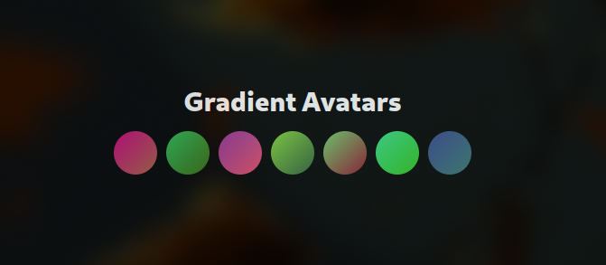

<p align="center">
  
</p>


# Gradient Avatars React


## Installation:
```bash
npm install avatar-gradient
pnpm install avatar-gradient
yarn install avatar-gradient
```

## Usage:
```tsx
import { Avatar } from "avatar-gradient";
import "avatar-gradient/dist/style.css";
function App() {
    return (
        <div>
          <Avatar username="test" />
        </div>
    );
}

export default App;

```

## Customization:
```tsx
import { Avatar } from "avatar-gradient";
import "avatar-gradient/dist/style.css";
function App() {
    return (
        <div>
          <Avatar username="test" style={{borderRadius:"0px"}} />
          <Avatar username="test" className="custom-style" />
        </div>
    );
}

export default App;

```